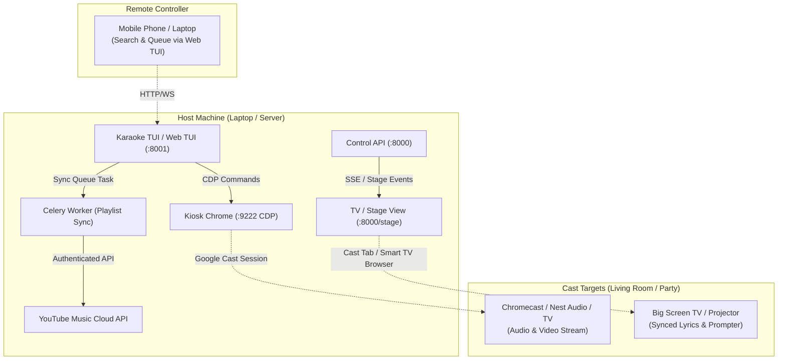

# Implementation Plan: Chromecast Dual Playback Fix & Two-Part Cast Architecture

## Goal Description
When casting music from YouTube Music on Linux, audio currently plays simultaneously from both the remote Cast device (Chromecast / Google Nest speaker) and the local laptop speakers (creating an echo/dual playback). Furthermore, background auto-dismiss scripts fight YouTube Music's cast state by attempting to unpause the local player, and the TUI queue stall detector erroneously triggers next-track skips.

This plan addresses:
1. **Immediate Bugfix**: Eliminating dual playback and auto-unpause conflicts when casting.
2. **Seamless Cloud Playlist Casting**: Pushing the queue/playlist to YouTube Music so the Chromecast natively receives the queue and transitions tracks without full page reloads or broken sessions.
3. **The Two-Part Cast Architecture**: Splitting the karaoke experience into **Part 1 (Cast Player / Audio/Video)** and **Part 2 (Cast TUI / Big-Screen Stage View)** with real-time synced lyrics.

---

## User Review Required

> [!IMPORTANT]
> **Cast Detection Strategy**: We leverage YouTube Music's native `ytmusic-player-bar.castConnectionState` (`'CONNECTED'` vs `'DISCONNECTED'`) via Chrome CDP to instantly detect cast sessions without heuristic scraping.

> [!TIP]
> **Cloud Playlists vs Single-Track CDP Navigation**: Casting single tracks by reloading the webpage (`Page.navigate`) interrupts Chromecast sessions. Mirroring the active queue into a YouTube Music playlist (`&list={playlist_id}`) allows the Chromecast to stream the entire queue natively with gapless transitions while the TUI follows along in `_ytmusic_queue_follow` mode.

---

## Architecture Overview



---

## Proposed Changes

### Component 1: Fix Double Playback & Auto-Advance Conflicts

#### [MODIFY] [`src/karaoke/player_open.py`](file:///home/tina/karaoke/src/karaoke/player_open.py)
1. **Update `_PLAYBACK_JS` to detect Cast State and Video Mute status**:
   Query `document.querySelector('ytmusic-player-bar')?.castConnectionState` and `ytmusic-cast-button`.
   Report `casting: true` when `castConnectionState === 'CONNECTED'`.
2. **Auto-Mute Local Video When Casting**:
   When `casting` is true, ensure `v.muted = true` so local PipeWire audio remains silent while the Cast device plays.
3. **Clean Up `_DISMISS_DIALOGS_JS`**:
   Remove generic `'afspelen'` / `'play'` from confirmation keywords (which was matching YouTube's main play button and forcing paused video to play). Keep only explicit advisory bypasses (`'toch afspelen'`, `'proceed'`, `'understand'`).
   Do NOT call `v.play()` if `casting` is active.

```diff
--- a/src/karaoke/player_open.py
+++ b/src/karaoke/player_open.py
@@ -262,7 +262,7 @@ _DISMISS_DIALOGS_JS = """(() => {
   const keywords = [
     'understand', 'proceed', 'exit app', 'play anyway', 'confirm', 'dismiss', 'continue', 'got it', 'accept',
     'begrijp', 'doorgaan', 'verdergaan', 'app afsluiten', 'app sluiten', 'toch afspelen', 'toch bekijken',
-    'afspelen', 'bevestigen', 'akkoord', 'sluiten', 'weergeven', 'bekijken', 'begrepen', 'ik begrijp het',
+    'bevestigen', 'akkoord', 'sluiten', 'weergeven', 'bekijken', 'begrepen', 'ik begrijp het',
     'openen', 'ja'
   ];
@@ -313,7 +313,9 @@ _DISMISS_DIALOGS_JS = """(() => {
   }
 
   const v = document.querySelector('video');
-  if (clickedCount > 0 && v && v.paused) {
+  const bar = document.querySelector('ytmusic-player-bar');
+  const isCasting = bar && bar.castConnectionState === 'CONNECTED';
+  if (clickedCount > 0 && v && v.paused && !isCasting) {
     v.play().catch(() => {});
   }
   return clickedCount;
@@ -450,14 +452,24 @@ def cdp_toggle_repeat() -> bool:
 _PLAYBACK_JS = """(() => {
   const v = document.querySelector('video');
+  const bar = document.querySelector('ytmusic-player-bar');
+  const isCasting = bar ? (bar.castConnectionState === 'CONNECTED' || bar.castConnectionState === 'CONNECTING') : false;
+  if (isCasting && v && !v.muted) {
+    v.muted = true;
+  }
   if (!v) return JSON.stringify({present: false, casting: isCasting});
   return JSON.stringify({
     present: true,
     ended: !!v.ended,
     paused: !!v.paused,
     position: v.currentTime || 0,
     duration: (isFinite(v.duration) ? v.duration : 0) || 0,
     readyState: v.readyState || 0,
+    muted: !!v.muted,
+    casting: isCasting,
     url: location.href
   });
 })()"""
```

#### [MODIFY] [`src/karaoke/tui.py`](file:///home/tina/karaoke/src/karaoke/tui.py)
In `_poll_player_finished()`:
- If `state.get("casting")` is True or `getattr(self, "_ytmusic_queue_follow", False)` is True:
  - Do NOT allow `track_idle` (`readyState == 0`) to trigger `action_queue_next()`.
  - Let YouTube Music / Chromecast own track progression while the TUI mirrors the active track.

---

### Component 2: Send Playlist to YouTube Music ("Cast Playlist")

#### [MODIFY] [`src/karaoke/tui.py`](file:///home/tina/karaoke/src/karaoke/tui.py)
1. **Auto-Follow Mode When Casting Detected**:
   - If `browser_playback()` reports `casting: True` and an active YouTube Music playlist (`list=...`) is playing, automatically set `_ytmusic_queue_follow = True`.
2. **Prominent Cast Queue Binding**:
   - Bind `Y` (or a dedicated button in the Web TUI) to `"Cast Queue to YT Music"`.
   - Creates/syncs a persistent `"Karaoke Queue"` playlist under the authenticated YouTube account (`schizoid69@gmail.com`), loads it onto the player, and hands complete playback to the Chromecast.

---

### Component 3: The Two-Part Cast Architecture (Player vs Stage View)

#### [NEW] [`src/karaoke/stage_view.py`](file:///home/tina/karaoke/src/karaoke/stage_view.py)
Dedicated lightweight, full-screen HTML/JS Stage view served at `GET /stage` or `GET /tv` on `ctrl_api` (port 8000):
- **Responsive Big-Screen UI**:
  - High-visibility typography for TV viewing.
  - Active line and word highlighting synchronized to `position_s`.
  - Up-Next banner showing upcoming queued singers/songs.
  - Beat indicator / rhythm visualizer.
- **Server-Sent Events (SSE) Endpoint**:
  `GET /api/stage/stream` broadcasting real-time playhead, metadata, and synced lyric lines at 10Hz.

#### [MODIFY] [`src/karaoke/ctrl_api.py`](file:///home/tina/karaoke/src/karaoke/ctrl_api.py)
Mount `/stage` and `/api/stage/stream` routes so any browser on the local network (smart TV, Chromecast with Google TV, tablet, second monitor) can display the live karaoke stage.

---

## Verification Plan

### Automated Tests
1. Unit tests for `player_open.py`:
   - Verify `_PLAYBACK_JS` correctly parses `casting` status.
   - Verify `dismiss_kiosk_dialogs()` does not click play during cast.
2. Unit tests for `tui.py`:
   - Verify `_poll_player_finished` ignores `track_idle` when `casting` is True.
3. Run existing test suite:
   ```bash
   pytest tests/test_player*.py
   ```

### Manual Verification
1. Open YouTube Music in kiosk Chrome (`http://localhost:9222`).
2. Start a Cast session to a Chromecast or smart speaker.
3. Verify that:
   - Laptop speakers stay completely silent while Cast device plays.
   - The TUI does not advance or skip tracks prematurely after 10 seconds.
   - Pressing `Y` mirrors the queue to YouTube Music and plays continuously on the Cast device.
   - Navigating to `http://<laptop-ip>:8000/stage` displays the live synced lyrics on a TV or second browser tab.
