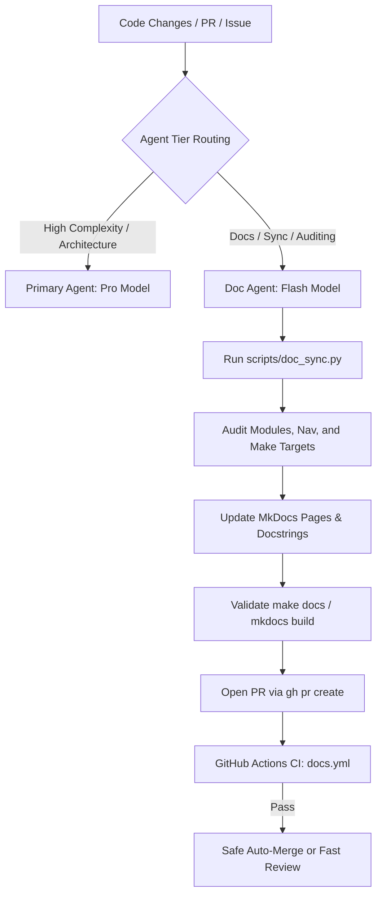

# Implementation Plan: Structured Documentation Agent & Cost-Efficient Workflow

## Goal Description

As the Karaoke codebase has grown rapidly across many AI tools, feature branches, and sub-systems, documentation and architecture diagrams have begun drifting from the actual implementation. High-tier reasoning models consume high token budgets when used for routine documentation synchronization, formatting, and file auditing.

This plan establishes a structured, cost-efficient system to keep documentation continuously synchronized with code changes:
1. **Lightweight Documentation Agent (`doc_maintainer`)**: Configured with a fast, lower-tier model (`flash`) to read code changes, update docstrings and MkDocs pages, run builds, and manage documentation PRs without burning high-tier tokens.
2. **MkDocs Autodoc Expansion (`mkdocstrings`)**: Transition manual doc pages to single-source-of-truth docstrings from Python modules, ensuring documentation updates automatically as functions and classes evolve.
3. **Automated Doc Drift & Audit Tool (`scripts/doc_sync.py` & `make docs-audit`)**: Automatically detects undocumented modules, unlinked Markdown files in `mkdocs.yml`, and outdated Makefile targets.
4. **Structured Git & PR Automation**: GitHub Actions CI workflow to validate docs (`mkdocs build --strict`), PR/Issue templates, and a safe auto-merge pathway for agent-driven documentation branches.

---

## User Review Required

> [!IMPORTANT]
> **Subagent Model Tier**: The documentation agent will default to the **`flash`** model when invoked. This drastically reduces token consumption (orders of magnitude lower than Pro/inherit) while remaining exceptionally capable at Markdown drafting, docstring parsing, and Git operations.

> [!NOTE]
> **Auto-Merge Policy**: For safety and visibility, the agent will create topic branches (`agent/docs-<feature>`) and open PRs using the GitHub CLI (`gh pr create`). We can enable automatic merging (`gh pr merge --auto --squash`) once GitHub Actions passes, or leave PRs open for a 1-click human merge.

---

## Open Questions

> [!NOTE]
> **Default PR Merge Preference**:
> 1. Should documentation PRs created by the agent be automatically merged once GitHub Actions passes (`--auto --squash`), or would you prefer to review and click merge yourself?
> 2. Would you like GitHub Pages enabled for this repository to host the compiled MkDocs site automatically via GitHub Actions?

---

## Proposed Changes

### 1. Documentation Audit & Synchronization Engine
Group: `scripts/` and `Makefile`

#### [NEW] `scripts/doc_sync.py`
A lightweight script that programmatically detects and optionally fixes documentation drift:
- Scans `src/karaoke/` for all Python modules and compares against `docs/api.md` (`::: karaoke.<module>`).
- Scans `docs/` for all `.md` files and verifies they are listed in `mkdocs.yml` navigation (flagging orphaned pages like `database.md`, `ingestion.md`).
- Checks `make help` output against `docs/makefile-targets.md`.
- Generates a JSON or formatted report for the doc agent to act on.

#### [MODIFY] `Makefile`
- Add `docs-audit`: runs `$(PYTHON) scripts/doc_sync.py --check`
- Add `docs-sync`: runs `$(PYTHON) scripts/doc_sync.py --fix` and updates `docs/makefile-targets.md`

---

### 2. MkDocs Configuration & Autodoc Expansion
Group: Documentation Structure

#### [MODIFY] `docs/api.md`
Add missing core platform modules to MkDocs autodoc via `mkdocstrings`:
- `::: karaoke.vector_index`
- `::: karaoke.librarysearch`
- `::: karaoke.radio_pipeline`
- `::: karaoke.postprocess_queue`
- `::: karaoke.postprocess_worker`
- `::: karaoke.track_analysis`
- `::: karaoke.audio_vector`
- `::: karaoke.admin_tui`
- `::: karaoke.ctrl_api`
- `::: karaoke.api`
- `::: karaoke.lockfile`
- `::: karaoke.tone`
- `::: karaoke.genre`
- `::: karaoke.autoclassify`

#### [MODIFY] `mkdocs.yml`
- Add currently unlinked pages (`database.md`, `ingestion.md`, `vector-search-plan.md`) to the navigation structure under appropriate sections (`Architecture` / `Data Model`).
- Deprecation cleanup: update `mermaid` configuration according to Mermaid2 recommendation.

---

### 3. Subagent Definition (`doc_maintainer`)
Group: Antigravity Subagent System

#### System Subagent: `doc_maintainer`
Defined via `define_subagent` with the following configuration:
- **Name**: `doc_maintainer`
- **Description**: "Maintains, syncs, and updates project documentation, API references, and MkDocs configurations using low-token Flash model."
- **Tools**: Write tools enabled (`run_command`, `replace_file_content`, `write_to_file`, `view_file`, `grep_search`, `find_by_name`).
- **System Prompt Guidelines**:
  - Focus purely on documentation, docstrings, and MkDocs site health.
  - Read code changes (`git diff`) and translate them into accurate docstrings and docs updates.
  - Validate all changes with `make docs` (`mkdocs build`).
  - Keep commits clean and targeted (`docs: update API reference for radio pipeline`).
  - Create and manage GitHub PRs via `gh pr create`.

---

### 4. GitHub Workflows & PR Templates
Group: `.github/`

#### [NEW] `.github/workflows/docs.yml`
GitHub Actions workflow triggered on push to `main` and pull requests modifying `docs/**`, `mkdocs.yml`, or `src/karaoke/**`:
- Installs documentation dependencies (`mkdocs`, `mkdocstrings[python]`, `mkdocs-material`, `mermaid2`).
- Runs `mkdocs build --strict` to ensure no broken internal links or autodoc failures enter `main`.

#### [NEW] `.github/PULL_REQUEST_TEMPLATE.md`
Standardized PR checklist:
- Summary of changes
- Associated Issue `#`
- Tests status (`pytest`)
- Documentation status (`make docs-audit` / `make docs`)

---

## Verification Plan

### Automated Tests
1. Run `python scripts/doc_sync.py --check` to identify current missing docs.
2. Run `python scripts/doc_sync.py --fix` to update `docs/api.md` and navigation.
3. Run `make docs` (`mkdocs build --strict`) to ensure zero build errors or missing references.
4. Run full test suite: `pytest` (ensure 1,600+ tests remain green).

### Manual Verification
1. Launch the newly defined `doc_maintainer` subagent with `Model: flash` to test a dry-run doc sync task and verify low token usage.
2. Verify GitHub CLI (`gh pr status` / `gh issue list`) integration.
