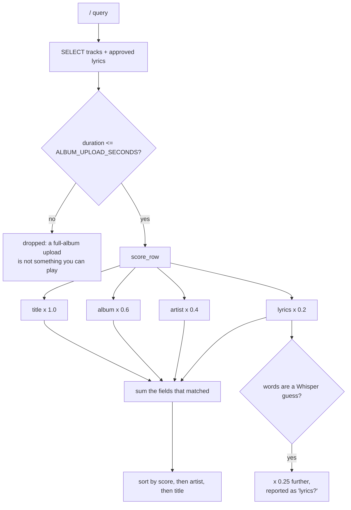

# Search: what runs, and how it is scored

There are **two different searches** in this project and they answer different
questions. Knowing which one is running explains most surprises.

| | where | index | answers |
|---|---|---|---|
| **Library search** | the TUI's `/` box | SQLite | "which track do I mean?" |
| **Semantic search** | `karaoke.search`, the API | OpenSearch | "which song goes like this?" |

The TUI's search box is the first one. It never touches OpenSearch, so the
vector index being empty or stale changes nothing about what you see when you
type in the TUI.

---

## Library search (the TUI box)

`karaoke.librarysearch.search()` reads every candidate track out of SQLite and
scores it in Python. No index, no server: the library is small enough that a
full scan is faster than anything that would need keeping in sync.



### The field weights

```
W_TITLE   1.0     what you almost always mean
W_ALBUM   0.6     narrower than an artist, so a hit is more deliberate
W_ARTIST  0.4     broad: matches everything they recorded
W_LYRICS  0.2     the fallback for "I only remember a line of it"
```

### How well a field matched

Position counts as well as presence, so searching `river` does not rank
*Riverside* and *The River* identically:

```
EXACT    1.0     the field is exactly the query
PREFIX   0.75    starts with the query, at a word boundary
WORD     0.6     the query appears as a whole word
PARTIAL  0.45    starts with the query mid-word ("Riverside" for "river")
CONTAINS 0.35    appears somewhere, inside a word
```

A track's score is the **sum** of every field that matched, not the best one. A
track matching on both title and artist is a better answer than one matching on
either alone, and should outrank it.

### Lyrics are matched differently

Only **whole-word** matches count in lyrics. Substring matching in a body of
text would make `love` match *glove* and *clover*, and the lyrics field would
then match nearly everything at its low weight rather than nothing.

So a lyric hit is always worth `0.6 x 0.2 = 0.12` — deliberately below any
title, album or artist match.

### Whisper's guesses score lower

Lyrics whose *words* are Whisper's own guess keep only a quarter of their
weight, and the matched field is reported as `lyrics?` rather than `lyrics`.

Two sources mean this and they are easy to confuse:

- `whisper` and `whisper_synced` — **the words are a guess**. Demoted.
- `whisper_aligned` — **the words are real**, from LRCLIB or a lyrics panel,
  and only the *timings* came from Whisper. Not demoted.

Demoted, not excluded: some tracks have no other text at all, and removing them
would make those songs unfindable by their words entirely.

### A worked example

```
query "skeletons"

  1.12  The Sound - Skeletons              title, lyrics
        title EXACT 1.0 x W_TITLE 1.0            = 1.00
        lyrics WORD  0.6 x W_LYRICS 0.2          = 0.12

  0.60  Mogwai - Kids Will Be Skeletons     title
        title WORD   0.6 x W_TITLE 1.0           = 0.60
```

---

## Smart Tokenized Multi-Word and Cross-Field Matching Fallbacks

Rather than matching only raw, exact query strings, the library search implements **smart tokenized and cross-field matching fallbacks** for multi-word queries. This allows typing combinations like artist and title (e.g., "Led Zeppelin Houses Holy") or entering words in a different order.

### 1. Multi-Word Single-Field Fallback
If the exact query string is not matched in a field (e.g., title, lyrics, artist), the algorithm:
1. Splits the query into lowercase tokens.
2. Filters out common stop words (e.g., `"the"`, `"and"`, `"with"`, `"for"`) to isolate meaningful words.
3. Performs word-boundary (`\b`) matching for each meaningful word in the field.
4. Scales the match score based on the ratio of words found:
   * **Metadata fields**: `WORD * (matched_count / total_meaningful) * 0.9`
   * **Lyrics**: `WORD * (matched_count / total_meaningful) * 0.8`

### 2. Cross-Field Matching Fallback
If no single-field match is scored, a global cross-field fallback evaluates the multi-word query across the combined metadata string (`artist + title + album`):
1. Matches the isolated meaningful tokens against the combined metadata string.
2. If any words match, it computes a unified score: `WORD * (matched_count / total_meaningful) * W_TITLE * 0.85`.
3. Displays the exact fields that contributed to the match (e.g., matching on both `artist` and `title` fields).

This eliminates the limitation where queries like `"portishead glory"` or `"sonic youth dirty"` yielded 0 hits.

---

## Real-Time Filtering, Sorting & Play Count Priority

Search results in the TUI (`/` box) pass through real-time filtering and sorting before display:

- **Energy / Mood Filter**: Matches are filtered by the active energy threshold (`energy ≥ X%`, set via `-` / `+` or mood presets) and mood band (🔥 High Energy, ⚡ Groovy, 🌙 Chill).
- **Sort Priority**: Search results can be sorted by:
  - `Artist / Title (A-Z)` (Default weighted search ranking)
  - `🌱 Priority: Least Played` (sorts by `play_count ASC` so undiscovered songs surface first)
  - `⭐ Most Played` (`play_count DESC`)
  - `🔥 Energy (High → Low)` / `🌙 Energy (Low → High)`
  - `🥁 BPM (Fast → Slow)` / `🎹 BPM (Slow → Fast)`
  - `🎵 Key`

---

## Semantic search (OpenSearch)

`karaoke.search` queries the `tracks` index and answers a different question:
*which song goes something like this*. It embeds the query and compares it to
each track's `lyrics_vector` (kNN), or runs a BM25 `multi_match` for keywords.

Keyword search demotes transcribed lyrics with a `boosting` query rather than
a filter, for the same reason the library search does: they are the only text
some tracks have.

### Synonym-Backed Search Analyzer (BM25 Optimizations)
Full-text keyword queries on `title`, `artist`, `album`, `plain_lyrics`, `text`, and `context` fields in OpenSearch leverage a custom **synonym expansion analyzer** (`synonym_analyzer`). Six pre-defined mapping buckets expand vocabulary at query time to catch conceptually identical terms:
* **Rock/Metal:** `rock, stoner rock, psychedelic rock, punk rock, post-punk, grunge, hard rock, heavy metal, metal`
* **Sad/Melancholy:** `sad, depressed, melancholy, blue, sorrow, gloom, tearful, crying, weeping, lonely, dark, tender`
* **Happy/Energetic:** `happy, glad, joyful, upbeat, cheerful, bright, high energy, energetic`
* **Chill/Calm:** `chill, mellow, relax, relaxing, calm, slow, down, ambient`
* **Hip-Hop/Soul:** `hip hop, rap, trap, r and b, rnb, soul, funk`
* **Electronic/Dance:** `techno, electronic, electronica, electro, synth, synthesizer, beats, drum and bass, dnb, dance, house, rave, club, party, EDM`

This expands search coverage automatically (e.g., searching for `"sad"` matches lyrics containing `"melancholy"` or `"gloom"`).

### Sentiment Vectors & Filter-Cached Hybrid Search

The `tracks` index stores both coarse mood labels and normalized mood vectors:
* **`dominant_mood`** (`keyword`): High-cardinality reuse category (`happy`, `sad`, `angry`, `tender`, `neutral`).
* **`sentiment_hits`** (`integer`): Total number of emotion lexicon hits in the lyrics.
* **`sentiment_vector`** (`knn_vector`, dimension: 4): Normalized mood distribution vector `(happy, sad, angry, tender)` indexed via Lucene HNSW with cosine similarity.

#### Query Cache & Bitset Acceleration
OpenSearch evaluates mood filters inside a `bool.filter` clause:
1. **Bitset Caching (Node Query Cache)**: Because `dominant_mood` has only 5 discrete values, Lucene builds and caches compact `RoaringDocIdSet` bitsets across queries with near-100% cache hit rates.
2. **k-NN Vector Pruning**: In `hybrid_search(query, k=5, mood="...")`, the cached bitset constrains k-NN graph exploration or triggers an exact bitset scan, avoiding expensive distance calculations against non-matching candidates.

#### Performance Benchmarks (17,633 Indexed Documents)
Measured using `scripts/benchmark_sentiment_search.py` on a live OpenSearch cluster:

| Query | Search Type | Mood Filter | Cold Latency | Warm Cache (Avg) | Hits |
| :--- | :--- | :---: | :---: | :---: | :---: |
| `"love"` | Keyword (unfiltered BM25) | — | 42.7 ms | 12.8 ms | 10 |
| `"love"` | Keyword (filtered) | `happy` | 15.3 ms | **6.7 ms** | 1 |
| `"love"` | Hybrid (semantic + BM25 + k-NN) | `happy` | 28.5 ms* | **21.3 ms** | 1 |
| `"sunshine"` | Keyword (filtered) | `tender` | 4.9 ms | **4.9 ms** | 0 |
| `"darkness"` | Keyword (filtered) | `sad` | 4.1 ms | **3.4 ms** | 0 |
| `"heartbreak"` | Keyword (filtered) | `neutral` | 3.2 ms | **2.5 ms** | 0 |

*\*Excludes initial one-time neural model load into memory.*

---

## Automatic Missing Postprocessing Detection on Song Load

When a song is loaded in the foreground, the system checks whether derived assets are missing without blocking the UI:

* **Trigger Points**:
  1. **Song Selection (`_show_selected_song`)**: Whenever a song is highlighted in the library or queue.
  2. **Song Open (`_open_selected`)**: Whenever a song is opened into playback.
  3. **Queue Play (`play_queue_index`)**: Whenever the play queue advances.
  4. **Folder Scan (`folder_scan.py`)**: After local ingestion, if audio analysis is skipped or lacks key/BPM.
* **Orchestration**:
  - Checks [`needs_postprocessing(track_id, conn)`](file:///home/tina/karaoke/src/karaoke/postprocess_queue.py) for missing key/BPM, missing Enhanced LRC word timings, or un-synced plain lyrics.
  - Non-blockingly dispatches Celery tasks (`karaoke.tasks.postprocess_track`) with session deduplication (`_postprocess_enqueued`).
  - Recognizes local audio files directly, enabling offline key/BPM analysis without requiring YouTube downloads.

### Two things worth knowing about the vectors

**A track with no words still has a lyric vector.** `_embedding_text` falls
back to `"{title} {artist} {album}"` when a track has no plain lyrics, and that
goes into the same field a lyric query searches. 74 of the indexed tracks are
in that state, so a search for a half-remembered line can return an
instrumental because its *title* is semantically close.

**Audio vectors cover very little.** The timbre index (`karaoke-audio`) holds
far fewer documents than the library has tracks, and most came from recording
samples rather than the library, so mood search over instrumentals is running
on almost nothing.

---

## What is *not* searched

- **Track notes** (artist biographies, raw transcriptions) live in
  `track_notes` and index into `<index>-notes` (fully bootstrapped with the synonym analyzer), which no search path queries yet.
- **Line-level lyrics** are indexed into `<index>-lines` for timing
  experiments, not used by either search above.

---

## Reading a result

The TUI shows which fields contributed to a hit. That is the quickest way to
understand a surprising ranking:

- `title` — matched the song name
- `artist`, `album` — matched, at lower weight
- `lyrics` — matched real words in the lyric body
- `lyrics?` — matched words that are a Whisper guess, scored at a quarter
